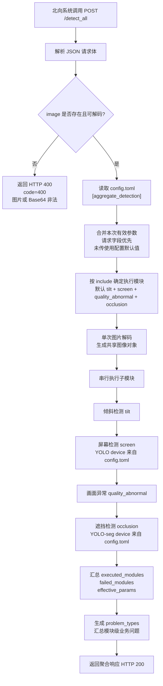
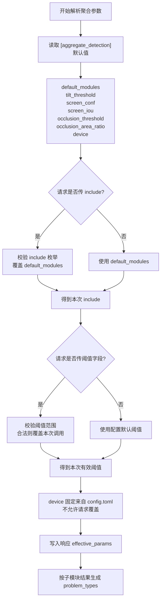
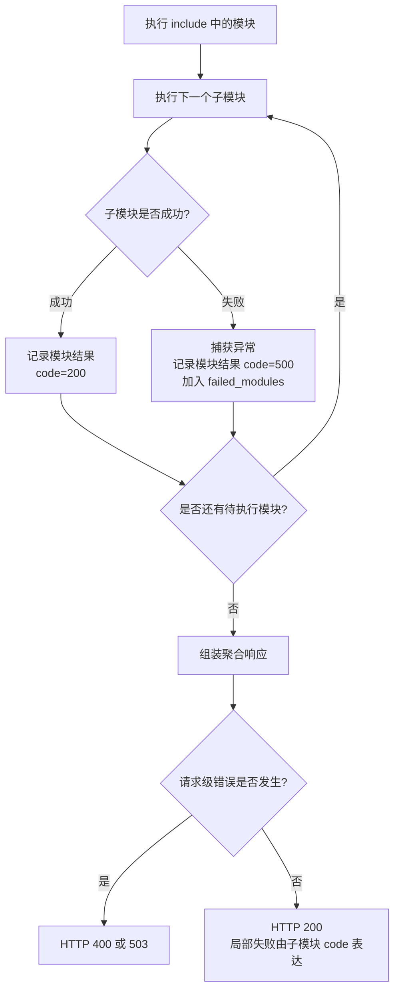

## Context

当前项目已经有以下单图或多图检测接口：

- `/detect_tilt`：倾斜检测，支持单图，JSON 字段主要为 `images` 或 `image`，也支持 raw base64。
- `/detect_screen`：屏幕/幕布类型检测，支持单图或多图，JSON 字段为 `images`。
- `/detect_inspect`：组合检测，当前只聚合倾斜检测和屏幕类型检测。
- `/detect_quality_abnormal`：画面异常检测，单图，检测虚焦、偏色、雪花噪点、花屏。
- `/detect_occlusion`：镜头遮挡检测，单图，使用 YOLO-seg 输出遮挡面积占比。

北向系统现在要得到同一张图的完整检测结果，需要多次请求服务。同一张 Base64 图片会被重复传输、重复解析和重复解码，调用链也更复杂。新增 `/detect_all` 的目标是把“同一张图需要的所有检测能力”收敛到一次请求。

现有 `/detect_inspect` 已经证明聚合模式可行，但其响应只包含 `tilt` 和 `screen`。本次新增接口不直接改造 `/detect_inspect`，避免改变已有调用方语义。

## Goals / Non-Goals

**Goals:**

- 新增 `POST /detect_all` 与 `POST /api/v1/detect_all`。
- 单张图片一次完成：
  - 倾斜检测；
  - 幕布/屏幕蓝、黑、白、正常检测；
  - 画面异常 4 类检测：虚焦、偏色、雪花噪点、花屏；
  - 镜头遮挡检测。
- 请求报文除 `image` 外均为可选字段；未传时使用 `[aggregate_detection]` 中的默认值，传入时只覆盖本次调用，不修改全局配置。
- 响应报文按子能力分块，保留每个子检测的 `code`、`msg`、`cost_ms`。
- 图片入参错误时整体 HTTP 400；子检测内部失败时，顶层默认仍 HTTP 200，并在对应子块中返回 `code=500`。
- 尽量复用一次图片解码结果，减少重复 CPU 开销。
- 保留现有所有分接口兼容。

**Non-Goals:**

- 本次不删除或替换 `/detect_inspect`。
- 本次不做批量全量检测；`/detect_all` 第一版只支持单图。
- 本次不新增统一总评分。
- 本次不新增遮挡物类别枚举。
- 本次不改动现有屏幕、遮挡、画面异常模型权重。
- 本次不实现聚合层并发调度，不释放并发和子模块超时配置；第一版固定串行执行，稳定优先。

## Decisions

### Decision 1: 新增 `/detect_all`，不复用 `/detect_inspect` 作为对外接口

`/detect_inspect` 当前文档语义是“倾斜 + 屏幕”。直接扩展它会让已有调用方收到新增字段，也可能引起“inspect 到底包含哪些检测”的语义混乱。新增 `/detect_all` 更清晰：

```text
/detect_inspect = 倾斜 + 屏幕
/detect_all     = 倾斜 + 屏幕 + 画面异常 + 遮挡
```

后续如果要废弃 `/detect_inspect`，可以单独做兼容迁移，不放在本次范围内。

### Decision 2: 请求报文使用单图字段 `image`

聚合接口第一版只支持单图。请求字段使用 `image`，不使用 `images`，避免让调用方误以为支持批量。

推荐请求报文：

```json
{
  "image": "base64字符串",
  "tilt_threshold": 1.5,
  "screen_conf": 0.25,
  "screen_iou": 0.45,
  "occlusion_threshold": 0.25,
  "occlusion_area_ratio": 0.2,
  "include": ["tilt", "screen", "quality_abnormal", "occlusion"]
}
```

字段说明：

| 字段 | 必填 | 类型 | 默认来源 | 说明 |
|------|------|------|----------|------|
| `image` | 是 | string | - | 单张图片 Base64，支持 data URL 前缀 |
| `tilt_threshold` | 否 | float | `[aggregate_detection].tilt_threshold` | 倾斜角度阈值，单位度 |
| `screen_conf` | 否 | float 0~1 | `[aggregate_detection].screen_conf` | 屏幕 YOLO 置信度 |
| `screen_iou` | 否 | float 0~1 | `[aggregate_detection].screen_iou` | 屏幕 YOLO NMS IoU |
| `occlusion_threshold` | 否 | float 0~1 | `[aggregate_detection].occlusion_threshold` | 遮挡 YOLO-seg 置信度 |
| `occlusion_area_ratio` | 否 | float 0~1 | `[aggregate_detection].occlusion_area_ratio` | 遮挡面积判定阈值 |
| `include` | 否 | string[] | `[aggregate_detection].default_modules` | 本次要执行的子检测模块 |

`include` 的合法值为：

```text
tilt
screen
quality_abnormal
occlusion
```

如果第一版希望接口更简单，也可以暂时不开放 `include`。但从工程上看，`include` 很有价值：北向可以只请求部分检测能力，减少不必要的 YOLO 推理。默认仍执行全部模块。

`screen_iou` 不是“屏幕相似度”或业务置信度，而是 YOLO 后处理 NMS 使用的 IoU 阈值。模型可能对同一个屏幕输出多个高度重叠的检测框，NMS 会根据 IoU 去掉重复框：

- 值越小：去重越严格，更容易删掉重叠框，最终框数量可能更少。
- 值越大：去重越宽松，更多重叠框可能被保留。

默认 `0.45` 属于常见取值。北向通常不需要传这个字段，只有在屏幕检测框重复或漏检调参时才需要覆盖。

### Decision 3: 响应报文按模块分块返回

推荐响应报文：

```json
{
  "code": 200,
  "msg": "检测完成",
  "start_time": "1753791280207",
  "end_time": "1753791281298",
  "cost_ms": 1091.4,
  "executed_modules": ["tilt", "screen", "quality_abnormal", "occlusion"],
  "failed_modules": [],
  "effective_params": {
    "tilt_threshold": 1.5,
    "screen_conf": 0.25,
    "screen_iou": 0.45,
    "occlusion_threshold": 0.25,
    "occlusion_area_ratio": 0.2,
    "include": ["tilt", "screen", "quality_abnormal", "occlusion"],
    "device": "cpu"
  },
  "problem_types": ["tilt", "screen", "quality_abnormal"],
  "tilt": {
    "code": 200,
    "msg": "检测完成",
    "cost_ms": 20.3,
    "result": {
      "is_tilted": true,
      "angle": 2.3
    }
  },
  "screen": {
    "code": 200,
    "msg": "检测完成",
    "cost_ms": 80.1,
    "primary": {
      "label": 1,
      "confidence": 0.91,
      "box": [100.0, 50.0, 900.0, 500.0]
    },
    "detections": [
      {
        "label": 1,
        "confidence": 0.91,
        "box": [100.0, 50.0, 900.0, 500.0]
      }
    ]
  },
  "quality_abnormal": {
    "code": 200,
    "msg": "检测完成",
    "cost_ms": 35.6,
    "is_abnormal": true,
    "abnormal_types": [1, 4],
    "results": [
      {"type": 1, "score": 0.76, "message": "疑似虚焦"},
      {"type": 4, "score": 0.71, "message": "疑似花屏"}
    ],
    "message": "检测到画面异常：虚焦、花屏"
  },
  "occlusion": {
    "code": 200,
    "msg": "检测完成",
    "cost_ms": 150.2,
    "is_occluded": false,
    "occlusion_area_ratio": 0.0,
    "score": 0.0,
    "threshold": 0.25,
    "area_ratio": 0.2,
    "message": "未检测到镜头遮挡"
  }
}
```

`problem_types` 是给北向快速判断用的顶层模块级业务结论，放在 `effective_params` 下方。它不替代各子模块明细；北向如果需要具体角度、屏幕 label、异常分数、遮挡面积，仍读取 `tilt`、`screen`、`quality_abnormal`、`occlusion`。

推荐结构：

| 字段 | 类型 | 说明 |
|------|------|------|
| `problem_types` | string[] | 顶层业务问题模块枚举数组；无业务问题时为空数组 |

第一版 `problem_types` 固定使用模块级枚举：

| 枚举 | 来源 | 判定规则 |
|------|------|----------|
| `tilt` | `tilt` | `tilt.code=200` 且 `tilt.result.is_tilted=true` |
| `screen` | `screen` | `screen.code=200` 且 `screen.primary=null`，或 `screen.primary.label` 为 `0`、`1`、`2` |
| `quality_abnormal` | `quality_abnormal` | `quality_abnormal.code=200` 且 `quality_abnormal.is_abnormal=true` |
| `occlusion` | `occlusion` | `occlusion.code=200` 且 `occlusion.is_occluded=true` |

`screen.primary.label=3` 表示正常屏，不加入 `problem_types`。如果某个子模块未执行或执行失败，不写入 `problem_types`；模块执行失败由 `failed_modules` 和对应模块 `code=500` 表达，避免把“业务问题”和“服务异常”混在一起。

例如 `problem_types=["tilt"]` 表示：本次成功执行的模块中，只有倾斜检测发现业务问题；如果 `screen`、`quality_abnormal`、`occlusion` 也都在 `executed_modules` 且不在 `failed_modules` 中，则它们对应结果块应表达无异常。

无业务问题时：

```json
{
  "problem_types": []
}
```

如果某个模块未执行，例如 `include=["tilt","quality_abnormal"]`，对应模块字段可返回 `null`：

```json
{
  "executed_modules": ["tilt", "quality_abnormal"],
  "failed_modules": [],
  "tilt": { "...": "..." },
  "screen": null,
  "quality_abnormal": { "...": "..." },
  "occlusion": null
}
```

### Decision 4: 子模块失败不默认拖垮整个接口

聚合接口的主要价值是一次请求拿到尽可能多的结果。默认策略：

- 请求体不是 JSON、缺失 `image`、Base64 无效、图片无法解码、图片超过大小限制：HTTP 400。
- 聚合接口未启用：HTTP 503 或 HTTP 400 均可；推荐 HTTP 503。
- 某个子检测运行失败：顶层 HTTP 200，失败模块返回 `code=500`，并加入 `failed_modules`。
- 如果所有已请求模块都失败：顶层仍可 HTTP 200，但 `code=207` 表示部分/全部子模块异常；或者保持 `code=200`。推荐顶层 HTTP 200 + `code=200`，以子模块 `code` 为准，避免北向因为单模块失败丢掉其他结果。

本次不释放 `fail_fast` 配置，固定采用“请求级错误整体失败、子模块错误局部失败”的策略。这样接口语义更稳定，也减少第一版配置复杂度。

### Decision 5: 释放 `[aggregate_detection]` 配置段

推荐新增配置：

```toml
[aggregate_detection]
# 全量聚合检测总开关
enabled = true
# 默认执行模块；请求 include 未传时使用
default_modules = ["tilt", "screen", "quality_abnormal", "occlusion"]
# 倾斜角度阈值，单位度
tilt_threshold = 1.5
# 屏幕 YOLO 置信度阈值
screen_conf = 0.25
# 屏幕 YOLO NMS IoU 阈值
screen_iou = 0.45
# 遮挡 YOLO-seg 置信度阈值
occlusion_threshold = 0.25
# 遮挡面积占比判定阈值
occlusion_area_ratio = 0.2
# 聚合接口中 YOLO 推理设备；支持 "cpu"、"cuda:0"、"cuda:1" 等
device = "cpu"
```

字段说明：

| 配置项 | 默认值 | 说明 |
|--------|--------|------|
| `aggregate_detection.enabled` | `true` | 是否启用 `/detect_all` |
| `aggregate_detection.default_modules` | `["tilt","screen","quality_abnormal","occlusion"]` | 请求未传 `include` 时执行的模块 |
| `aggregate_detection.tilt_threshold` | `1.5` | 聚合接口默认倾斜角度阈值，单位度 |
| `aggregate_detection.screen_conf` | `0.25` | 聚合接口默认屏幕 YOLO 置信度阈值 |
| `aggregate_detection.screen_iou` | `0.45` | 聚合接口默认屏幕 YOLO NMS IoU 阈值 |
| `aggregate_detection.occlusion_threshold` | `0.25` | 聚合接口默认遮挡 YOLO-seg 置信度阈值 |
| `aggregate_detection.occlusion_area_ratio` | `0.2` | 聚合接口默认遮挡面积占比判定阈值 |
| `aggregate_detection.device` | `"cpu"` | 聚合接口中 YOLO 推理设备，支持 `"cpu"`、`"cuda:0"`、`"cuda:1"` 等字符串 |

聚合接口使用 `[aggregate_detection]` 作为自己的默认参数来源，分接口继续使用各自原有配置段。这样 `/detect_all` 的默认行为可以独立调参，不影响 `/detect_screen`、`/detect_occlusion` 等既有接口。

`device` 只作为配置项，不建议作为请求字段开放。它属于部署资源参数，不是单次业务判定参数；如果允许调用方按请求切换 CPU/GPU，线上资源调度会不可控。响应中的 `effective_params.device` 回显实际使用设备即可。

### Decision 6: 第一版固定串行执行，后续根据耗时再评估是否并行

倾斜和画面异常是 OpenCV CPU 规则；屏幕和遮挡都是 YOLO 模型推理。直接并发可能造成 GPU/CPU 资源争用，尤其 MacBook 本地或单 worker 部署时，未必更快。

第一版建议：

```text
decode once
  -> tilt
  -> screen
  -> quality_abnormal
  -> occlusion
  -> aggregate response
```

本次不释放 `parallel` 和 `module_timeout_ms` 配置。后续如果真实压测证明串行耗时不可接受，再单独设计并发策略：

- CPU OpenCV 模块并行；
- YOLO 模块串行；
- 或按设备隔离并发。

### Decision 7: 复用服务层能力，不通过 HTTP 调用内部接口

聚合接口不应在服务内部再请求 `/detect_tilt`、`/detect_screen` 等 HTTP 接口。原因：

- 会重复 JSON 解析、Base64 处理和异常包装；
- 难以共享同一份解码图像；
- 增加内部网络调用和错误处理复杂度。

推荐新增 `aggregate_detector.py` 作为编排层，复用现有服务函数，并在必要时补充“从已解码图片执行检测”的内部函数。

## Mermaid DSL 设计流程图

### 聚合检测主流程



### 参数默认值与请求覆盖流程



### 子模块失败隔离流程



## Risks / Trade-offs

- [Risk] 聚合接口总耗时会接近四个检测模块耗时之和。→ Mitigation: 第一版固定串行执行并返回每个模块 `cost_ms`，用真实数据决定后续是否单独设计并发。
- [Risk] 子模块失败时顶层 HTTP 200 可能让调用方忽略局部失败。→ Mitigation: 响应提供 `failed_modules`，并要求北向按子模块 `code` 判断。
- [Risk] `include` 增加接口灵活性，也增加测试矩阵。→ Mitigation: 限定合法枚举，默认全量检测。
- [Risk] 共享解码图像需要整理现有服务层函数。→ Mitigation: 保持外部接口不变，只新增内部复用函数或编排适配层。
- [Risk] 聚合接口中存在屏幕和遮挡两次 YOLO 推理，设备配置不当可能导致 CPU 慢或 GPU 不可用。→ Mitigation: 通过 `[aggregate_detection].device` 明确聚合接口 YOLO 推理设备，并在响应 `effective_params.device` 中回显。

## Migration Plan

1. 新增聚合请求/响应 schema。
2. 新增 `[aggregate_detection]` 配置段和配置读取模型。
3. 新增 `aggregate_detector.py` 编排服务。
4. 新增 `/detect_all` 路由并注册到 v1 router。
5. 补充内部服务函数，减少同图重复解码。
6. 更新 API 文档和 README。
7. 增加单元测试、路由测试和部署验证脚本。

Rollback：

- 保留原有分接口不变；如果聚合接口上线后有问题，可临时从北向停止调用 `/detect_all`，回退到原有多接口调用方式。
- 服务端可通过 `aggregate_detection.enabled=false` 禁用聚合接口。

## Open Questions

- 是否需要第一版开放 `include`？推荐开放，默认全量检测。
- 顶层 `code` 是否需要在部分失败时返回 `207`？推荐保持 `200`，局部失败看子模块 `code`。
- 是否允许请求覆盖 `device`？推荐不开放，只通过 `config.toml` 控制。
