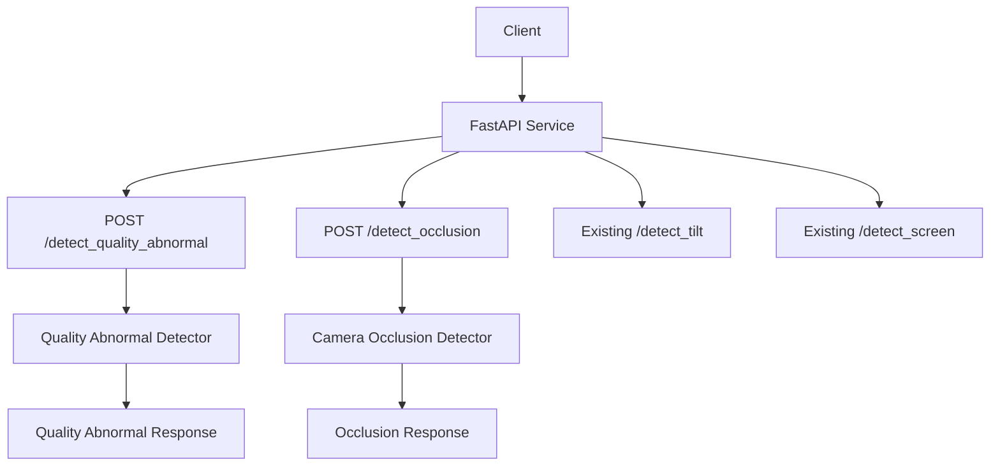
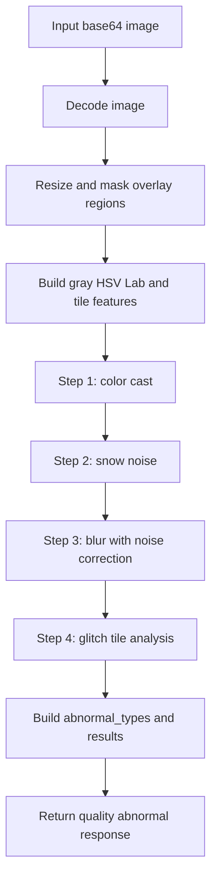
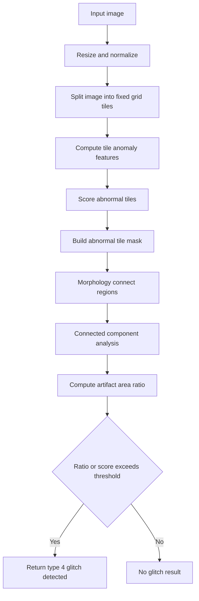
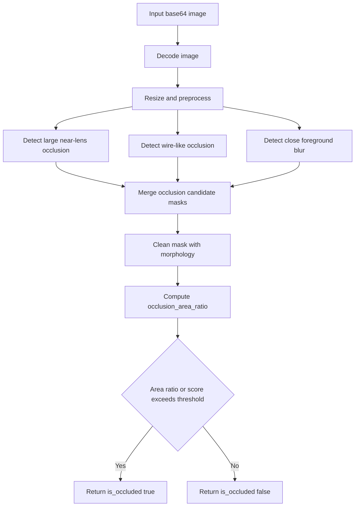
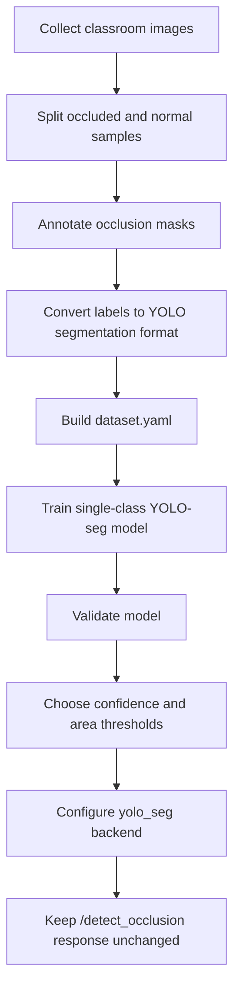

## Context

当前服务是 FastAPI + OpenCV + YOLO 的图像检测服务，已有能力包括：

- `/detect_tilt`：基于 OpenCV 线段角度的画面歪斜检测。
- `/detect_screen`：基于 `model/screen.pt` 的屏幕类型检测。
- `/detect_inspect`：组合倾斜检测和屏幕类型检测。

业务新增样例位于 `test/图像检测`，主要包含画面异常和镜头遮挡两类问题。画面歪斜已由现有能力覆盖，本次重点补齐：

- 画面异常：虚焦、偏色、雪花噪点、花屏。
- 镜头遮挡：镜头前或镜头不远处遮挡，第一版只输出是否遮挡和遮挡面积占比。

约束：

- 文档和接口定义使用中文语义。
- 画面异常初版使用 OpenCV 规则，不依赖 GPU。
- 花屏初版目标是达到约 70% 准确率，先做单图规则检测，不做多帧持续性判断。
- 遮挡接口第一版不输出遮挡物类型枚举。
- 遮挡第一版可用 OpenCV 规则实现并返回面积估算；后续可替换为单类 YOLO-seg 分割模型，但接口不变。
- 现有接口必须保持兼容。

## Goals / Non-Goals

**Goals:**

- 新增 `/detect_quality_abnormal` 和 `/api/v1/detect_quality_abnormal`。
- 新增 `/detect_occlusion` 和 `/api/v1/detect_occlusion`。
- 画面异常接口支持多异常同时命中，并返回命中类型的明细。
- 画面异常枚举固定为 `1=虚焦`、`2=偏色`、`3=雪花噪点`、`4=花屏`。
- 遮挡接口返回是否遮挡、遮挡面积占比、检测分数和提示信息。
- 新增配置段，允许调整各检测阈值、分析尺寸、开关和遮挡后端。
- 基于 `test/图像检测` 补充验收脚本和文档。

**Non-Goals:**

- 本次不训练 YOLO-seg 模型。
- 本次不要求花屏达到生产级稳定，只要求规则初版可覆盖明显花屏样例，目标约 70% 准确率。
- 本次不实现多帧持续性判断；接口输入仍为单张图片 Base64。
- 本次不输出遮挡物类别枚举。
- 本次不改变 `/detect_tilt`、`/detect_screen`、`/detect_inspect` 的现有响应结构。

## Decisions

### Decision 1: 新增两个独立接口，而不是合并到现有 `/detect_screen`

画面异常和镜头遮挡属于画质/摄像头状态判断，不是屏幕类型检测。合并到 `/detect_screen` 会混淆语义，也会使当前 YOLO 屏幕检测结果和新规则检测结果耦合。

备选方案：

- 扩展 `/detect_screen`：改动小，但接口语义错误，且无法表达多异常。
- 扩展 `/detect_inspect`：适合作为后续聚合入口，但不适合作为两个基础能力的唯一入口。

结论：新增两个基础接口，后续如需要再把它们接入 `/detect_inspect` 或新聚合接口。

### Decision 2: 画面异常使用共享预处理和独立检测器

画面异常四类检测共享同一张图像的解码、缩放、灰度图、HSV、Lab 和分块特征。为了避免重复计算，服务层应先做共享预处理，再调用四个独立 detector。

检测顺序采用：

1. 偏色。
2. 雪花噪点。
3. 虚焦。
4. 花屏。

原因：

- 偏色主要依赖色彩空间统计，和其他异常耦合较弱。
- 雪花噪点会增加高频特征，可能干扰虚焦判断，因此先判噪点。
- 虚焦需要结合噪点状态修正清晰度指标。
- 花屏容易受偏色、噪声和局部模糊影响，放最后做综合判断。

### Decision 3: 画面异常响应只返回命中的异常明细

接口响应使用：

- `is_abnormal`: 是否存在任一画面异常。
- `abnormal_types`: 命中的异常枚举数组。
- `results`: 仅包含 `abnormal_types` 中命中的异常明细。
- `message`: 总体提示。

这避免返回大量未命中的低分项，也保持多异常场景可解释。

### Decision 4: 花屏第一版使用简化 OpenCV 分块规则

用户提出的完整流程包含多尺度、重叠切块、相邻块关系、形态学、连通域、行列分布和多帧持续性判断。该流程适合生产增强版，但第一版目标是约 70% 准确率，单张图片输入，不应引入多帧状态。

第一版保留：

- 固定尺寸或固定网格切块。
- 块内特征：颜色异常、局部方差、纹理突变、块状边界异常。
- 异常块 mask。
- 形态学连接。
- 连通域和异常面积占比。

第一版排除：

- 多帧持续性判断。
- 复杂多尺度策略。
- 重叠切块。
- 模型训练。

### Decision 5: 遮挡接口第一版只输出是否遮挡和面积占比

遮挡类型枚举会引入标注和规则复杂度，第一版暂不输出。接口聚焦两个业务关键值：

- `is_occluded`: 是否镜头近处遮挡。
- `occlusion_area_ratio`: 遮挡区域占整图面积比例。

OpenCV 后端的面积为估算值。后续启用 YOLO-seg 后端后，面积由分割 mask 计算，接口保持不变。

### Decision 6: 预留单类 YOLO-seg 遮挡后端

如果 OpenCV 遮挡规则不能满足准确率，遮挡检测可替换为单类 YOLO-seg 分割模型：

- 类别：`occlusion`。
- 输出：所有遮挡 mask 合并后的面积占比。
- 正常图片作为负样本。
- 标注建议使用 YOLO segmentation 格式；也可以先用 COCO/Labelme/CVAT 导出，再转换为 YOLO-seg。

建议数据量：

- 可行性实验：80–150 张遮挡正样本 + 200–500 张正常负样本。
- 第一版可用：300–500 张遮挡正样本 + 500–1000 张正常负样本。
- 生产稳定：1000+ 张遮挡正样本 + 2000+ 张正常负样本。

## Risks / Trade-offs

- [Risk] OpenCV 花屏规则泛化不足。→ Mitigation: 将花屏目标设为初版约 70%，通过 `test/图像检测/画面异常/花屏` 验证，后续再考虑模型或多帧增强。
- [Risk] 虚焦判断被时间戳、水印、字幕等高频区域干扰。→ Mitigation: 分析前裁剪或屏蔽固定 overlay 区域，使用分块中位数/分位数而非单一全图 Laplacian。
- [Risk] 雪花噪点会抬高清晰度指标，导致虚焦漏判。→ Mitigation: 先判噪点，再对虚焦分数做噪声修正。
- [Risk] OpenCV 遮挡面积是估算值，不是像素级真值。→ Mitigation: 响应字段命名为 `occlusion_area_ratio`，文档说明 OpenCV 后端为估算；后续 YOLO-seg 后端可提供更准确 mask 面积。
- [Risk] 电线类遮挡属于细长目标，OpenCV 和低分辨率 YOLO-seg 都可能漏检。→ Mitigation: 第一版规则单独处理线状遮挡；若使用 YOLO-seg，训练和推理分辨率需考虑 960/1280。
- [Risk] 新增接口增加 CPU 开销。→ Mitigation: 共享预处理结果，配置分析尺寸，避免重复解码和重复 resize。
- [Risk] 后续 YOLO-seg 需要数据和标注，当前样例量不足。→ Mitigation: 本次只预留后端接口和数据格式说明，不把模型训练作为本次实现前置条件。

## Migration Plan

1. 新增 schema、service 和 router，不改现有接口行为。
2. 新增配置段，默认启用 OpenCV 规则后端。
3. 更新 API 文档和 README 说明。
4. 使用 `test/图像检测` 执行本地验收。
5. 如上线后出现误判，可通过配置阈值调优或临时关闭具体检测项。
6. 如 OpenCV 遮挡效果不足，后续添加 `yolo_seg` 后端并挂载模型权重，保持接口不变。

## Open Questions

- 画面异常阈值是否需要按不同教室/摄像头单独配置。
- 是否需要将两个新能力接入 `/detect_inspect`，还是仅提供独立接口。
- 遮挡面积占比是否需要同时返回像素面积。
- 花屏验收的 70% 准确率是以 accuracy、recall 还是人工验收通过率计量。
